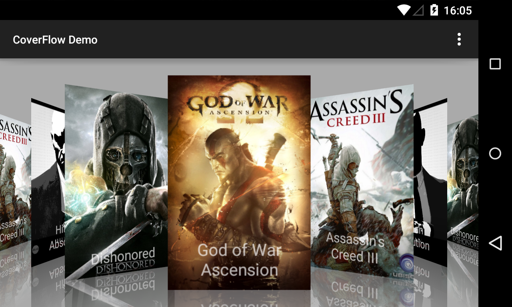

[](http://www.repostatus.org/#suspended)

Coverflow
=============
### Description
Android CoverFlow widget with demo.
Forked from [applm/ma-components](https://github.com/applm/ma-components).

### Screenshot



### Code Samples
For example, in your layout:

```xml
<it.moondroid.coverflow.components.ui.containers.FeatureCoverFlow
        android:id="@+id/coverflow"
        android:layout_width="match_parent"
        android:layout_height="match_parent"
        coverflow:coverHeight="@dimen/cover_height"
        coverflow:coverWidth="@dimen/cover_width"
        coverflow:maxScaleFactor="1.5"
        coverflow:reflectionGap="0px"
        coverflow:rotationThreshold="0.5"
        coverflow:scalingThreshold="0.5"
        coverflow:spacing="0.6" />
```


then in your Activity:

```java
        mCoverFlow = (FeatureCoverFlow) findViewById(R.id.coverflow);
        mCoverFlow.setAdapter(mAdapter);

        mCoverFlow.setOnItemClickListener(new AdapterView.OnItemClickListener() {
            @Override
            public void onItemClick(AdapterView<?> parent, View view, int position, long id) {
                //TODO CoverFlow item clicked
            }
        });

        mCoverFlow.setOnScrollPositionListener(new FeatureCoverFlow.OnScrollPositionListener() {
            @Override
            public void onScrolledToPosition(int position) {
                //TODO CoverFlow stopped to position
            }

            @Override
            public void onScrolling() {
                //TODO CoverFlow began scrolling
            }
        });
```

### Quick Start

CoverFlow is pushed to Maven Central as a AAR, so you just need to add the following dependency to your `build.gradle`:

    dependencies {
        compile 'com.github.moondroid.coverflow:library:1.0'
    }


### License

```
The MIT License (MIT)

Copyright (c) 2014 Marco Granatiero

Permission is hereby granted, free of charge, to any person obtaining a copy
of this software and associated documentation files (the "Software"), to deal
in the Software without restriction, including without limitation the rights
to use, copy, modify, merge, publish, distribute, sublicense, and/or sell
copies of the Software, and to permit persons to whom the Software is
furnished to do so, subject to the following conditions:

The above copyright notice and this permission notice shall be included in all
copies or substantial portions of the Software.

THE SOFTWARE IS PROVIDED "AS IS", WITHOUT WARRANTY OF ANY KIND, EXPRESS OR
IMPLIED, INCLUDING BUT NOT LIMITED TO THE WARRANTIES OF MERCHANTABILITY,
FITNESS FOR A PARTICULAR PURPOSE AND NONINFRINGEMENT. IN NO EVENT SHALL THE
AUTHORS OR COPYRIGHT HOLDERS BE LIABLE FOR ANY CLAIM, DAMAGES OR OTHER
LIABILITY, WHETHER IN AN ACTION OF CONTRACT, TORT OR OTHERWISE, ARISING FROM,
OUT OF OR IN CONNECTION WITH THE SOFTWARE OR THE USE OR OTHER DEALINGS IN THE
SOFTWARE.
```
